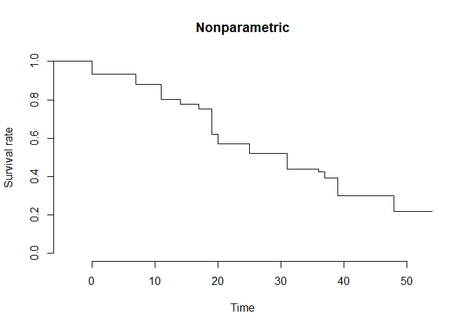

<!-- README.md is generated from README.Rmd. Please edit that file -->

# IntCens

The `IntCens` package provides non- and semi-parametric methods for
analyzing interval-censored data. This includes iterative estimation
routines for proportional hazards and proportional odds models, as well
as nonparametric maximum likelihood estimation.

## Installation

You can install the development version of IntCens from
[GitHub](https://github.com/) with:

``` r
# install.packages("devtools")
devtools::install_github("lmaowisc/IntCens")
```

## Example

The main function for fitting nonparametric, PH, and PO models is
`icsurvfit()`. Below is a basic example:

``` r
library(IntCens)
## basic example code
# A dataset containing interval-censored observations and a treatment indicator 
# (radiation vs. radiation plus chemotherapy)
data(bcos)
n <- nrow(bcos) # sample size
# Extract the left and right endpoints of the intervals
set.seed(123)
L <- bcos$left + rnorm(n, 0, 0.0001) # add random noise
R <- bcos$right + rnorm(n, 0, 0.0001)
# Covariate (binary)
Z <- as.numeric(bcos$treatment == "RadChem")

# Nonparametric
obj_np <- icsurvfit(L, R)
plot(obj_np, main = "Nonparametric")
```



``` r

# Cox model (PH)
obj_ph <- icsurvfit(L, R, Z, model = "PH")
obj_ph
#> 
#> Call:
#> icsurvfit(L = L, R = R, Z = Z, model = "PH")
#> 
#> NPMLE of proportional hazards for interval-censored data:
#> 
#> ICM algorithm converges in 21 iterations.
#> 
#> Maximum Likelihood Estimates for Regression parameters:
#> 
#>      Estimate  StdErr z.value  p.value   
#> [1,]  0.83568 0.30446  2.7448 0.006055 **
#> ---
#> Signif. codes:  0 '***' 0.001 '**' 0.01 '*' 0.05 '.' 0.1 ' ' 1
```

``` r

# Proportional odds model (PO)
obj_po <- icsurvfit(L, R, Z, model = "PO")
obj_po
#> 
#> Call:
#> icsurvfit(L = L, R = R, Z = Z, model = "PO")
#> 
#> NPMLE of proportional odds for interval-censored data:
#> 
#> ICM algorithm converges in 20 iterations.
#> 
#> Maximum Likelihood Estimates for Regression parameters:
#> 
#>      Estimate  StdErr z.value p.value  
#> [1,]  0.91123 0.41753  2.1824 0.02908 *
#> ---
#> Signif. codes:  0 '***' 0.001 '**' 0.01 '*' 0.05 '.' 0.1 ' ' 1
```
